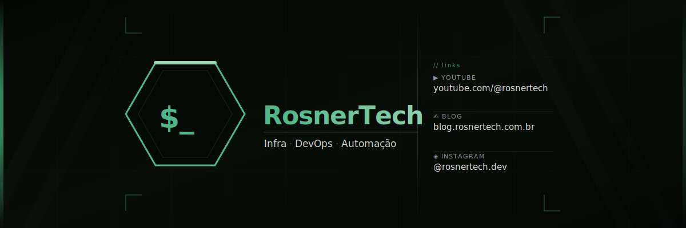

  

<h1 align="center">🚀 Rosner Pelaes Nascimento</h1>

  <b>System Engineer | Network Automation | Infraestrutura | DevOps</b>

  
  

---

## 🧠 Sobre mim (PT-BR)

Sou **System Engineer** com mais de **12 anos de experiência** em infraestrutura, redes e automação, atuando atualmente com forte foco em **Network Automation**, **Infrastructure as Code (IaC)** e **ambientes Cloud escaláveis**.

Atuo no desenho, desenvolvimento e operação de soluções automatizadas utilizando **Python, APIs e pipelines de CI/CD**, aplicadas ao provisionamento, configuração, monitoramento e operação de ambientes de rede e sistemas críticos, sempre buscando **redução de trabalho manual e aumento de confiabilidade**.

Tenho experiência com **redes LAN, WAN, VPN, SD-WAN e Cloud**, incluindo integração com **AWS (VPC, routing e conectividade)**, além da administração de **firewalls, wireless corporativo e autenticação**. Também atuo fortemente com **observabilidade**, utilizando **Zabbix, Grafana e soluções de logging**.

Valorizo **boas práticas DevOps**, documentação, padronização e colaboração entre times de infraestrutura, desenvolvimento, segurança e operações.

---

## 🛠️ Tecnologias & Foco Atual

  

- 🐍 Python & Network Automation  
- 🏗️ Infrastructure as Code (IaC)  
- 🔁 CI/CD & APIs  
- ☁️ AWS Networking  
- 📊 Observabilidade (Zabbix, Grafana)  
- 🔐 Segurança & DevOps  

---

## 🏠 Homelab

🚀 Projeto de **homelab documentado por fases**, aplicando conceitos reais de infraestrutura, redes, segurança e DevOps.

👉 https://github.com/RosnerTech/rocketraccoon-homelab

---
## 🐍 Contribution Snake

<picture>
  <source media="(prefers-color-scheme: dark)" 
          srcset="https://raw.githubusercontent.com/RosnerTech/RosnerTech/output/github-contribution-grid-snake-dark.svg">
  <source media="(prefers-color-scheme: light)" 
          srcset="https://raw.githubusercontent.com/RosnerTech/RosnerTech/output/github-contribution-grid-snake.svg">
  
</picture>

---

# 🌍 About Me (EN)

I am a **System Engineer** with over **12 years of experience** in infrastructure, networking, and automation, currently focused on **Network Automation**, **Infrastructure as Code (IaC)**, and **scalable Cloud environments**.

I design, develop, and operate automated solutions using **Python, APIs, and CI/CD pipelines** to provision, configure, monitor, and operate network environments and critical systems, always aiming to **reduce manual effort and increase reliability**.

My experience includes **LAN, WAN, VPN, SD-WAN, and Cloud networking**, including **AWS (VPC, routing, and connectivity)**, as well as administration of **firewalls, enterprise wireless, and authentication systems**. I also work extensively with **observability**, using **Zabbix, Grafana, and logging platforms**.

I strongly value **DevOps best practices**, documentation, standardization, and collaboration across infrastructure, development, security, and operations teams.

---

## 📫 Contact

📧 rosner@rosnertech.com.br  
📧 ros.tecinfo@gmail.com  
🌐 https://blog.rosnertech.com.br

  <i>“Build, automate, document, and improve continuously.”</i>

