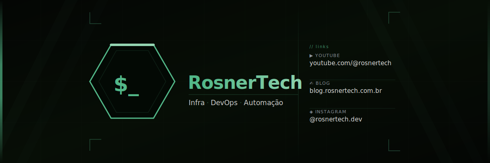

  

<h1 align="center">Rosner Pelaes Nascimento</h1>

  <b>Systems Engineer · Network Automation · Infrastructure as Code · DevOps</b>

  
  
  
  

---

## Sobre mim

Systems Engineer com mais de 12 anos automatizando infraestruturas complexas — redes, sistemas e cloud — em ambientes corporativos e de alta escala.

Trabalho no desenho e implementação de soluções com **Python, APIs e pipelines de CI/CD** para provisionamento, configuração e operação de ambientes críticos. Meu foco atual é **Network Automation** e **Infrastructure as Code**: reduzir trabalho manual, aumentar confiabilidade e entregar mudanças de forma segura e versionada.

Atuo com redes **LAN, WAN, VPN, SD-WAN e Cloud**, integração com **AWS** (VPC, routing e conectividade), administração de firewalls, wireless corporativo e autenticação. Em observabilidade, uso **Zabbix, Grafana** e soluções de logging para garantir visibilidade proativa e melhoria contínua.

Valorizo documentação, padronização e compartilhamento de conhecimento — por isso criei o **RosnerTech**, canal no YouTube e blog onde publico conteúdo técnico sobre Infra, DevOps e Automação sem enrolação.

---

## Stack tecnológica

### Infra & Redes

  

  
  
  

### Automação & DevOps

  

  
  
  

### Observabilidade & Segurança

  
  
  

---

## Áreas de atuação

- 🏗️ Infraestrutura On-Premises e Virtualizada
- 🌐 Redes, Firewall e Segurança
- 🐳 Containers e DevOps
- 🔍 Observabilidade e Monitoramento
- 🤖 Network Automation e IaC
- 🏠 Homelab como laboratório real

---

## Homelab em destaque

Projeto principal documentado por fases, aplicando conceitos reais de infraestrutura e DevOps:

  

`Proxmox` · `OPNsense` · `Pi-hole` · `Nginx Proxy Manager` · `Portainer` · `PNETLab` · `GNS3`

---

## GitHub Stats

  

---

## Contribuições

<picture>
  <source media="(prefers-color-scheme: dark)"
    srcset="https://raw.githubusercontent.com/RosnerTech/RosnerTech/output/github-snake-dark.svg" />
  <source media="(prefers-color-scheme: light)"
    srcset="https://raw.githubusercontent.com/RosnerTech/RosnerTech/output/github-snake.svg" />
  
</picture>

---

## Contato

📧 contato@rosnertech.com.br
🌐 blog.rosnertech.com.br

---

  <i>"Aprender infraestrutura é construir, quebrar, corrigir e documentar."</i>

